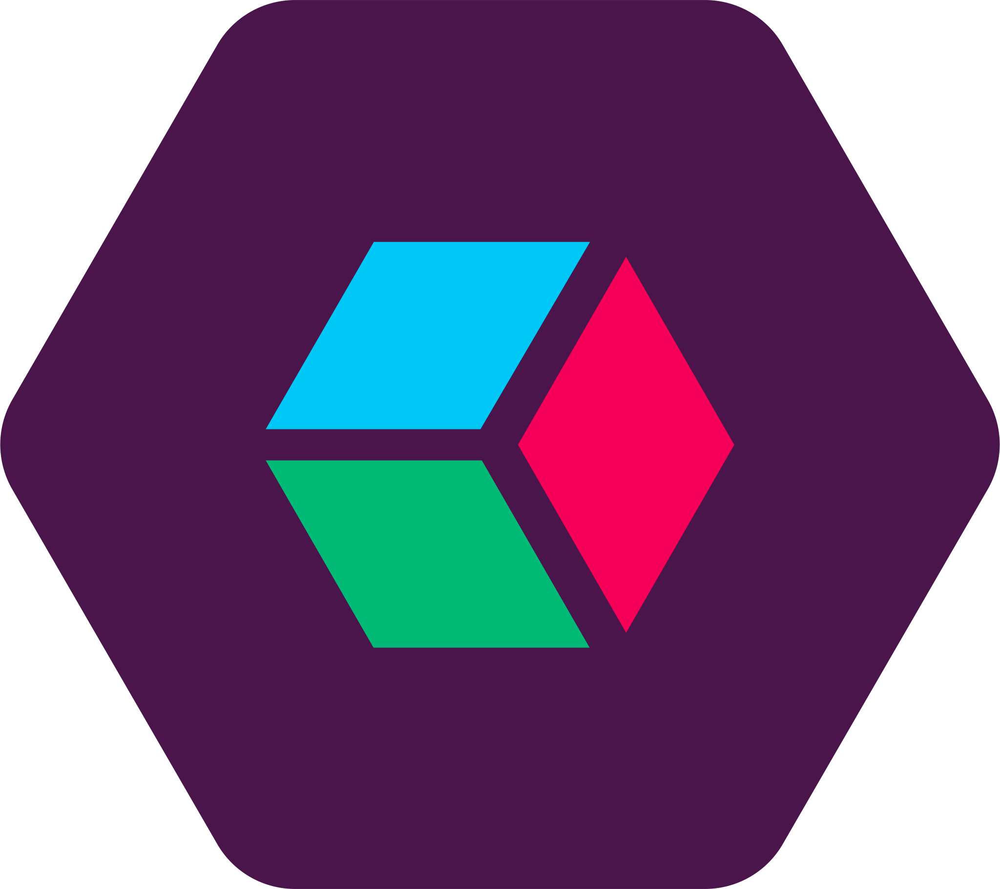

<p align="center">
    
</p>

<p align="center">
    <h3 align="center">Slack for Google Cloud Logging</h3>
</p>

<p align="center">
    Transport messages (and objects) from Google Cloud Logging to Slack
    <br />
    <br />
    <a href="#space_invader--usage">Quick Start Guide</a>
    ·
    <a href="https://github.com/bjerkio/gcl-slack/issues">Request Feature</a>
    ·
    <a href="https://github.com/bjerkio/gcl-slack/issues">Report Bug</a>
  </p>
</p>

---

[](https://www.tidyverse.org/lifecycle/#experimental)
[](https://github.com/prettier/prettier)
[](http://commitizen.github.io/cz-cli/)


[](https://lgtm.com/projects/g/bjerkio/gcl-slack/context:javascript)
[](https://codecov.io/gh/bjerkio/gcl-slack)
[](https://codeclimate.com/github/bjerkio/gcl-slack/maintainability)

**gcl-slack** consumes logs from Google Cloud Logger and forwards them to Slack.
Use this library to let your team know something happened in your app, an
exception is thrown or use the special [slack object] to turn structured logs to
well-formatted Slack messages.

[slack object]: #
[slack blocks]: https://api.slack.com/block-kit

### :zap: &nbsp; Features

- Supports Slack webhook and the Slack API ⚙️
- [Slack blocks] 📦

### :space_invader: &nbsp; Usage

```shell
▶ yarn add gcl-slack
```

You can deploy however you want, with Pulumi's [Callback
Function][pulumi-callback] or with [Firebase CLI][firebase].

**We are currently building this library out, and once things are ready for
production loads, we'll add tutorials to make it easier to configure this**

You'll need to configure a [sink] in order to make this work. The basic design
of library, is that you'll create a [search query] which you add to a [sink] to
forward log entries to `gcl-slack`.

[sink]: https://cloud.google.com/logging/docs/export/configure_export_v2
[search query]: https://cloud.google.com/logging/docs/view/advanced-queries

### Turn structured logs to well-formatted Slack messages

This package solves two issues, a) forwarding information from Cloud Logger to
Slack and b) offload requests to Slack API / webhooks.

Sometimes we want to be notified on Slack when something happens – let's say a
user is created or a customer subscribed to your service. Since out the output
of our application is hooked into Cloud Logging, we can output a message or a
JSON object (structured logging). With a sink, we can route log entites to this
library through Google PubSub.

To create more than just a simple message, you can use [slack object]s, which is
the same as you would send to either the Slack API or webhooks to create
well-formatted slack messages.

Let your Kubernetes Pod, Cloud Run or Cloud Functions focus on core business,
and let distribute your logging to Slack with this library!

[pulumi-callback]:
  https://www.pulumi.com/blog/simple-serverless-programming-with-google-cloud-functions-and-pulumi/
[firebase]: https://firebase.google.com/docs/functions/get-started

## Contribute & Disclaimer

We love to get help 🙏 Read more about how to get started in
[CONTRIBUTING](CONTRIBUTING.md) 🌳
